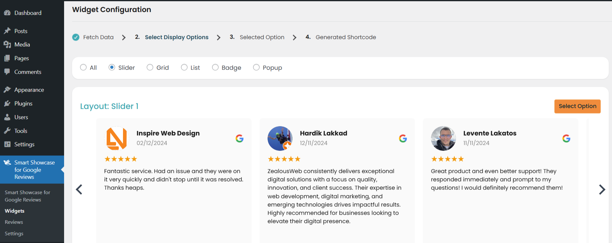
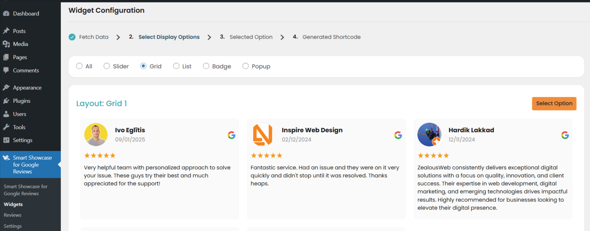
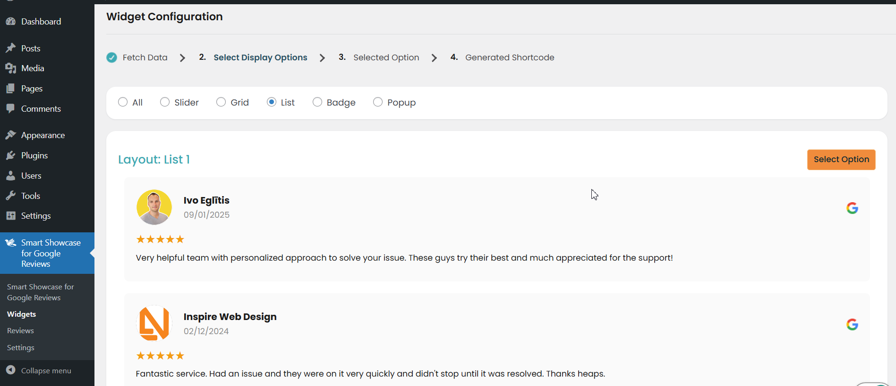
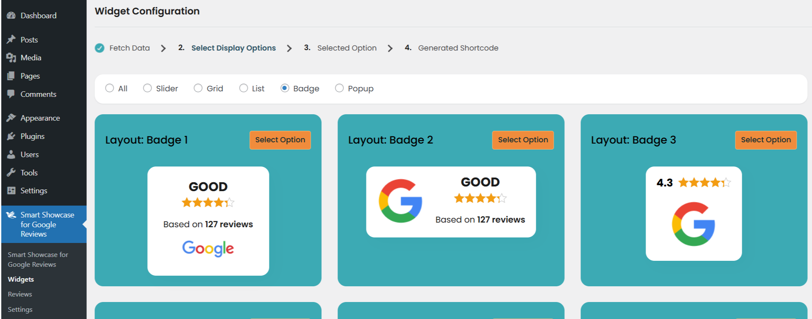

# Smart Google Reviews

Smart Google Reviews is a comprehensive WordPress plugin that enables businesses to effortlessly display customer reviews from Google on their websites. By syncing reviews directly from Google My Business, this plugin helps build trust and credibility with potential customers. With a range of display options including grids, lists, sliders, badges, and popups, you can showcase reviews in a format that best suits your site’s design.

Customize the look and feel with custom CSS, and place reviews anywhere on your site using shortcodes. The plugin also supports multiple languages and complies with GDPR, ensuring a seamless and secure user experience. Additionally, Smart Google Reviews offers admin management features, including form fields for review replies, filters for sorting reviews, and notification systems for new reviews and replies. Whether you’re using Elementor, WPBakery, or Divi, this plugin integrates smoothly with your page builder to enhance your site’s functionality and appearance.

**Features of Smart Google Reviews**
- Unlimited Review Widgets - Display unlimited Google reviews widgets.
- Syncing of Google reviews from Google My Business
- Cron Job has Options daily, weekly, monthly
- Review Reply Form Fields - name, email, review title, and review message - Admin manage Form
- Filters for sorting reviews by Rating, Keywords
- Display Option Grid, List, Slider, Badge, Popup
- Custom CSS support for design tweaks
- Generate Shortcodes for embedding reviews anywhere on the site with attributes
    - Number of reviews displayed
    - Rating filters
    - Location wise
- Customize number of reviews displayed
- 5+ Widget Design layouts
- Compatibility with standard page builders like elementor, WPBakery, and Divi
- Load more reviews and Limit Functionality
- Trim long reviews with “read more” link
- Responsive Slider, Grid, and List layouts
- Notify admins of new reviews - with selection admin or other
- Send notification emails to users after submitting reply to reviews
- Keep all reviews in a WordPress database (CPT)
- Multi-language support
- Full GDPR support
- Admin approval system for reviews
- Multilingual support with automatic translation options for user-submitted reviews
- Create and display review widgets in sidebars and footers, showing the latest reviews and average star ratings.
- ‘Review us on G’ button to collect new Google Reviews
- Show/hide any elements (business photo, name, rating, reviews, avatars, names, time and etc)

**Features of Smart Google Reviews Pro**

- Dashboard for review statistics
    - Total reviews
    - Average rating
    - Top reviews
    - Date range filter
    - Color Selection
- Multi-location support to pull reviews from multiple Google Business listings
- Structured data support for products, services, and local businesses
- Upload your own Google business photo
- Option to export/import reviews in CSV format
- Integration with WooCommerce to display reviews on product pages - Aligned with filter option
- Options to highlight featured reviews or pin important reviews at the top
- Customizable templates for automatic replies to approved reviews
- Advanced spam detection using AI or machine learning algorithms like adult content etc
- Automatic replies to users based on their star rating (positive or negative) (Using AI)
- Integration with Google Analytics to track user interaction with reviews

<strong>[Demo for Smart Google Reviews Pro]()</strong>

**OUR OTHER PLUGINS**

* <strong>[Accept PayPal Payments Using Contact Form 7 Pro](https://store.zealousweb.com/accept-paypal-payments-using-contact-form-7-pro)</strong>
* <strong>[Accept Stripe Payments Using Contact Form 7 Pro](https://store.zealousweb.com/accept-stripe-payments-using-contact-form-7-pro)</strong>
* <strong>[Accept Authorize.NET Payments Using Contact Form 7 Pro](https://store.zealousweb.com/accept-authorize-net-payments-using-contact-form-7-pro)</strong>
* <strong>[Accept 2Checkout Payments Using Contact Form 7 Pro](https://store.zealousweb.com/accept-2checkout-payments-using-contact-form-7-pro)</strong>
* <strong>[Accept Sagepay(Opayo) Payments Using Contact Form 7 Pro](https://store.zealousweb.com/accept-sage-pay-opayo-payments-using-contact-form-7-pro)</strong>
* <strong>[User Registration Using Contact Form 7 Pro](https://store.zealousweb.com/user-registration-using-contact-form-7-pro)</strong>
* <strong>[Abandoned Contact Form 7 Pro](https://store.zealousweb.com/abandoned-contact-form-7-pro)</strong>
* <strong>[Smart Appointment & Booking Pro](https://store.zealousweb.com/smart-appointment-booking-pro)</strong>
* <strong>[Custom Product Options WooCommerce Pro](https://store.zealousweb.com/custom-product-options-woocommerce-pro)</strong>
* <strong>[Generate PDF Using Contact Form 7 Pro](https://store.zealousweb.com/generate-pdf-using-contact-form-7-pro)</strong>
* <strong>[Accept Elavon Payments Using Contact Form 7 Pro](https://store.zealousweb.com/accept-elavon-payments-using-contact-form-7-pro)</strong>

# Installation
1. Download the plugin zip file from WordPress.org plugin site to your desktop / PC
2. If the file is downloaded as a zip archive, extract the plugin folder to your desktop.
3. With your FTP program, upload the plugin folder to the wp-content/plugins folder in your WordPress directory online
4. Go to the Plugin screen and find the newly uploaded Plugin in the list.
5. Click ‘Activate Plugin’ to activate it.

# How To Use
How to Configure the Smart Google Reviews Plugin

**1. Install and Activate the Plugin**
- Step 1: From your WordPress admin dashboard, navigate to Plugins > Add New.
- Step 2: Search for Smart Google Reviews.
- Step 3: Click Install Now, then Activate to activate the plug

**For Smart Google Reviews > Connect with your Google**

- After activating the plugin, you'll need to connect your Google Reviews business account to fetch and display reviews on your site.
- Click on the Connect with Google button to authorize the plugin with your Google account. You may be prompted to sign in to your Google account and grant the necessary permissions.
- Once connected, the plugin will be able to fetch reviews from your business profile.

**For Smart Google Reviews > Smart Google Reviews**

-This section provides an overview of your Google reviews and the following statistics
 
- **Total Reviews:** Displays the total number of reviews for your business.
- **Average Review:** Shows the average rating from all reviews.
- **Statistics Chart:** Visualizes your reviews, providing insights into the overall rating distribution.
- **Rating Top Reviews:** Highlights your highest-rated reviews for better engagement and social proof.

**For Smart Google Reviews > Widgets**

- In this section, you can configure the display settings for the Google Reviews widget on your site.
**Configuration Steps**
- **Fetch Data:**
- Fetch the latest Google reviews from your business profile.

**Select Display Options:**
- Choose how the reviews will appear on your site. Available display options include:

**Slider:** 
- Show reviews in a scrolling slider format.

**Grid:** 
- Display reviews in a grid layout.

**List:** 
- Show reviews in a simple list format.

**Badge:** 
- Display a badge-style widget with reviews.

**Popup:** 
- Show reviews in a popup window.

**Widget Settings:**

- **Filter Rating:** Filter reviews based on a specific rating (e.g., 5-star reviews).
- **Hide Element:** Show or hide specific elements (e.g., reviewer name, rating, date, review content, reviewer photo, Google icon).
- **Keywords:** Filter reviews by entering keywords separated by commas.
- **Review Us on Google:** Enable or disable a call-to-action for visitors to leave a review.
- **Trim Long Reviews:** Set a character limit with a "Read More" link for longer reviews.
- **Language:** Choose the language for displaying reviews.
- **Date Format:** Select the preferred date format.
- **Sort By:** Sort reviews by Newest, Highest Rating, or Lowest Rating.
- **Show Sort By Filter:** Enable or disable the "Sort By" filter on the front end.
- **Load More:** Enable or disable the "Load More" button for additional reviews.
- **Number of Reviews:** Set the number of reviews to display.
- **Custom CSS:** Add custom CSS for further widget styling.

**Generated Shortcode:**

- Once the widget is configured, a shortcode will be generated. You can insert this shortcode into any page, post, or widget area to display the reviews.

**For Smart Google Reviews > Reviews**

- This section allows you to view and manage the reviews collected from Google. You can list all reviews and choose to show or hide specific reviews based on your preferences.

**For Smart Google Reviews > settings**

- This section allows you to configure advanced settings for the plugin:

**Google Settings:** 
- Set your Google business account details and manage Google review settings.

**SEO & Notifications:**

- **Enable Admin Notifications:** Enable email notifications to be sent to the admin when a new review is posted.
- **Custom Email Addresses:** Set custom email addresses for receiving notifications.
- **Custom Email Subject:** Customize the subject line for email notifications.
- **Email Body:** Customize the content of the notification email.

**Advanced:**

- **Sync Reviews:** 
- Choose whether to automatically or manually sync new reviews from Google.
- Google Analytics Tracking ID: Enter your Google Analytics Tracking ID for review tracking.

**SMTP Settings:**

- Configure SMTP for sending email notifications.

- **From Email Address:** Set the email address that will appear as the sender.
- **From Name:** Set the sender's name.
- **SMTP Host:** Specify the SMTP server host.
- **Type of Encryption:** Choose the type of encryption for your SMTP server (None, SSL, TLS).
- **Port:** Specify the SMTP server port.
- **SMTP Authentication:** Toggle on/off SMTP authentication. If enabled, provide the SMTP username and password.

**Test Mail:**

- Send a test email to verify the configuration.

- **To Email:** Enter the recipient's email address.
- **Subject:** Set the subject for the test email.
- **Message:** Enter a message to send in the test email.

# Getting Help

If you have any difficulties while using this Plugin, please feel free to contact us at support@zealousweb.com. We also offer custom WordPress extension development and WordPress theme design services to fulfill your e-commerce objectives. Our professional dy‐ namic WordPress experts provide profound and customer-oriented development of your project within short timeframes. Thank you for choosing a Plugin developed by ZealousWeb!

